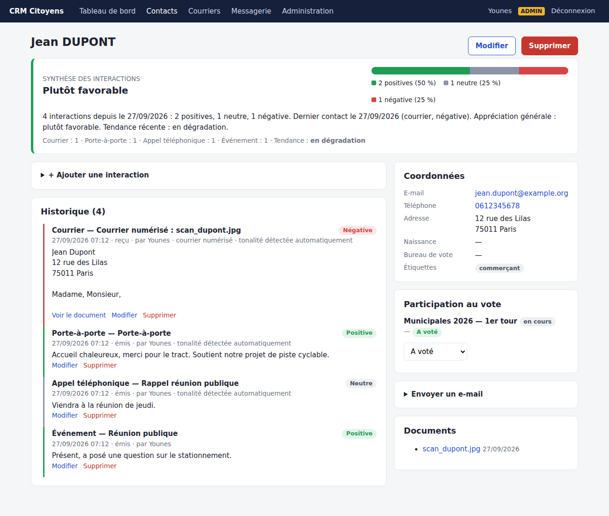
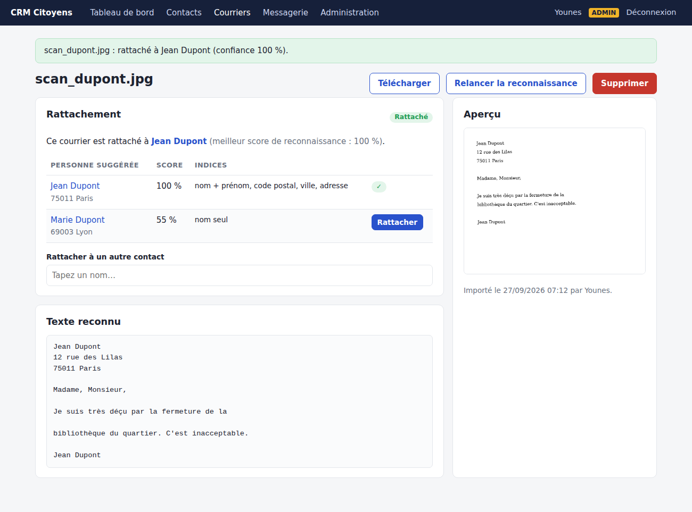

# CRM Citoyens

CRM pour campagnes électorales et relation avec les habitants : fiches contacts,
historique des échanges, suivi de la participation au vote, liaison avec la boîte
mail et numérisation de courriers rattachés automatiquement à la bonne personne.



## Fonctionnalités

- **Deux espaces protégés par mot de passe**
  - *Administrateur* : gestion des comptes, des élections, de la boîte mail,
    import/export CSV, suppression de contacts et de documents.
  - *Utilisateur* : consultation et mise à jour des fiches, ajout d'interactions,
    pointage du vote, numérisation de courriers, synchronisation des e-mails.
  - Mots de passe hachés, protection CSRF, blocage après 5 échecs de connexion.
- **Fiches contacts** : coordonnées, bureau de vote, étiquettes, notes ; recherche
  et filtres (nom, ville, e-mail, étiquette, a voté / n'a pas voté).
- **Participation au vote** par élection (« A voté » en un clic depuis la liste,
  pratique le jour du scrutin), taux de participation sur le tableau de bord.
- **Interactions** : appel, porte-à-porte, rencontre, e-mail, courrier, SMS,
  événement… avec tonalité positive / neutre / négative (détectée
  automatiquement à partir du texte ou choisie à la main).
- **Synthèse** en haut de chaque fiche : répartition positive/neutre/négative,
  appréciation générale (plutôt favorable / neutre / défavorable, les échanges
  récents pesant davantage), tendance récente, dernier contact.
- **Boîte mail (IMAP/SMTP)** : les e-mails échangés avec les contacts sont
  importés dans leur historique (sans doublon, messages laissés non lus) ;
  envoi d'e-mails depuis la fiche.
- **Courriers scannés (OCR)** : déposez des photos/scans/PDF ; le texte est lu
  (Tesseract, français) et la personne est **retrouvée automatiquement** :
  nom + prénom (tolérant aux fautes d'OCR, à l'ordre inversé, aux noms composés,
  aux initiales), confirmés par l'adresse, le code postal, la ville, l'e-mail ou
  le téléphone. En cas de doute (ex. « Famille Dupont » avec deux Dupont en base),
  le document passe « À vérifier » avec des suggestions classées.



## Installation

Prérequis : Python 3.10+ et, pour l'OCR des images, Tesseract avec la langue française.

```bash
# Debian / Ubuntu
sudo apt install tesseract-ocr tesseract-ocr-fra
# macOS : brew install tesseract tesseract-lang

python3 -m venv .venv
source .venv/bin/activate
pip install -r requirements.txt
python run.py            # http://127.0.0.1:5000
```

Au premier lancement, l'application demande de créer le **compte administrateur**.
Les comptes utilisateurs se créent ensuite dans *Administration* (ou en ligne de
commande : `flask --app run create-user NOM [--admin]`).

### Relier la boîte mail

*Administration → Configurer la boîte mail* : serveur IMAP (SSL, port 993),
identifiant, mot de passe (pour Gmail : un « mot de passe d'application »),
dossier des envoyés si vous voulez aussi importer vos réponses, et SMTP pour
l'envoi. La synchronisation se lance avec le bouton *Synchroniser* ou
automatiquement via cron :

```cron
*/15 * * * * cd /chemin/crm && .venv/bin/flask --app run sync-mail
```

### Import de contacts

CSV (séparateur `;` ou `,`) avec les colonnes : `civilite, prenom, nom, email,
telephone, adresse, code_postal, ville, bureau_vote, tags, notes`. Un contact
existant (même e-mail, ou mêmes nom/prénom/code postal) est mis à jour.

## Configuration (variables d'environnement)

| Variable | Rôle | Défaut |
|---|---|---|
| `CRM_SECRET_KEY` | clé de session | générée dans `instance/secret_key` |
| `CRM_DATABASE_URL` | base SQLAlchemy (SQLite, PostgreSQL…) | `instance/crm.db` |
| `CRM_UPLOAD_FOLDER` | stockage des courriers | `instance/uploads` |
| `CRM_OCR_LANG` | langues Tesseract | `fra+eng` |
| `CRM_HOST` / `CRM_PORT` | écoute du serveur de dev | `127.0.0.1` / `5000` |

En production, servez l'application derrière HTTPS avec un serveur WSGI
(`gunicorn -w 2 'run:app'`) et sauvegardez régulièrement le dossier `instance/`.

## Tests

```bash
pytest
```

## Données personnelles (RGPD)

Les opinions politiques supposées sont des **données sensibles** (art. 9 RGPD) :
limitez l'accès aux personnes habilitées, informez les personnes concernées,
respectez les recommandations de la CNIL pour les campagnes électorales,
chiffrez le disque du serveur et supprimez les données à l'issue de la campagne.
Le mot de passe de la boîte mail est stocké dans la base : protégez-la en conséquence.
Toute l'analyse (OCR, reconnaissance, tonalité) se fait localement, sans service externe.

## Structure

```
app/
  __init__.py      création de l'app, sécurité (CSRF, en-têtes), commandes CLI
  models.py        User, Contact, Interaction, Election, VoteRecord, Document, Setting
  auth.py          connexion, premier admin, rôles
  contacts.py      fiches, interactions, vote, envoi d'e-mail
  documents.py     numérisation et rattachement des courriers
  mail.py, admin.py, main.py
  services/        ocr, matching (reconnaissance des noms), sentiment, summary, mailbox
tests/             tests automatisés (pytest)
```
